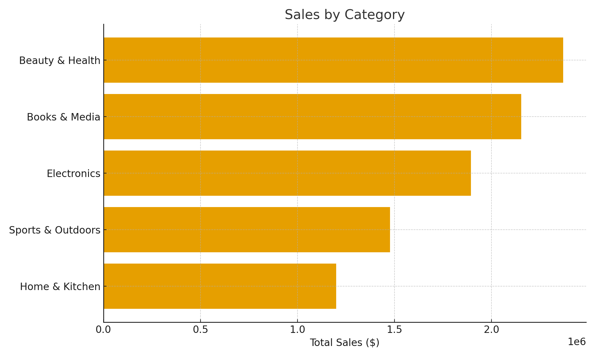

# Retail Sales Analysis (Excel)

This is a simple, end‑to‑end analysis I put together to practice turning retail transaction data into clear takeaways. I kept the first version in **Excel** (pivot tables + charts) because that’s what most entry‑level analyst roles expect. I’ll extend it with **SQL** next.

---

## What’s here
- A single Excel workbook with cleaned pivots and charts
- A few exported PNGs so you can scan the results quickly in the repo
- A short write‑up of what I looked at and why

**Workbook:** `Retail Analytics Complete.xlsx`

---

## Dataset (columns in plain English)
- **orders**: order id, customer id, order date/time, sales channel, store id, campaign id  
- **order_items**: order id, product id, quantity, price/discount/tax/shipping, **TotalSales**  
- **products**: product id, category, subcategory, brand  
- **customers**: customer id, age, gender, region, state, signup date, loyalty tier  
- **shipments / returns / payments**: standard logistics and payment fields

The data spans multiple years. I focused on revenue, product mix, regions, and loyalty tiers.

---

## How I approached it (Excel workflow)
1. Related the tables (orders ↔ order_items ↔ products ↔ customers).
2. Built pivots for: **Monthly Sales**, **Top Brands**, **Category Mix**, **Regional Sales**, and **Loyalty Revenue**.
3. Added a **3‑month moving average** to the monthly line so the trend is easier to read.
4. Cleaned the charts (currency axes, sorted bars, minimal clutter) and exported them as PNGs.

---

## Charts (quick scan)





You can open the workbook to see the underlying pivots:
- **Monthly Sales (3mo MA)**
- **Top 10 Brands by Sales**
- **Sales by Category**
- **Sales by Region (clean)**
- **Loyalty Revenue (clean)**

---

## What stood out to me
- Month‑to‑month revenue is reasonably steady with a noticeable **seasonal lift mid‑year**; the 3‑month average makes this clearer.
- Revenue is **concentrated in a handful of brands** (a typical 80/20 pattern).
- **Category mix** shows a few clear leaders that drive most of the revenue.
- Regions perform differently; there’s room for **targeted campaigns** in the weaker areas.
- **Loyalty tiers** account for a meaningful share of revenue, which suggests tier incentives could be worth testing.

I’ll replace these bullets with specific numbers once I finalize the SQL pass.

---

## What I used
- **Excel**: Pivot Tables, basic data cleaning, charting
- **(Coming soon) SQL**: schema, joins, aggregations, KPI queries

---

## Repo layout
```
.
├─ README.md
├─ Retail Analytics Complete.xlsx
├─ monthly_sales.png
├─ top10_brands_by_sales.png
├─ sales_by_category.png
├─ sales_by_region.png
├─ loyalty_revenue_by_tier.png
└─ David_Ramirez_Project_Executive_Summary.pdf


---

## Next steps
- Add a small SQL schema and load the same data
- Recreate the core metrics in SQL (revenue, AOV, top N, regional/loyalty breakdowns)
- Compare Excel vs. SQL results and note any differences

If you have feedback or questions about the approach, feel free to reach out.
